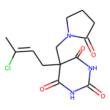

# Servier ML Technical Test 🧪


---


## I. Context

The prediction of a drug molecule properties plays an important role in the drug design process. The molecule properties are the cause of failure for 60% of all drugs in the clinical phases. A multi parameters optimization using machine learning methods can be used to choose an optimized molecule to be subjected to more extensive studies and to avoid any clinical phase failure.

We developed two models able to predict the property P1 of a molecule given its SMILE representation.

The proposed application can be used for **retrieving a model's prediction**, for **evaluating a given model** or for **training a new model from scratch**.

## II. Models

### A/ Model 1

This model takes the extracted features of a molecule as input and predict the P1 property. The 2048 extracted fingerprint features retrieved from  `feature_extractor.py` module will served as input for this model.

We propose a simple **1D Convolutional Neural Network (CNN)** for addressing this task. Below we provide the details of the chosen architecture:

```
_________________________________________________________________
Layer (type)                 Output Shape              Param #   
=================================================================
embedding_1 (Embedding)      (None, 2048, 50)          51200     
_________________________________________________________________
conv1d_7 (Conv1D)            (None, 2039, 192)         96192     
_________________________________________________________________
batch_normalization_1 (Batch (None, 2039, 192)         768       
_________________________________________________________________
conv1d_8 (Conv1D)            (None, 2037, 192)         110784    
_________________________________________________________________
flatten_2 (Flatten)          (None, 391104)            0         
_________________________________________________________________
dense_4 (Dense)              (None, 128)               50061440  
_________________________________________________________________
dropout_8 (Dropout)          (None, 128)               0         
_________________________________________________________________
dense_5 (Dense)              (None, 1)                 129       
=================================================================
Total params: 50,320,513
Trainable params: 50,320,129
Non-trainable params: 384
_________________________________________________________________
```

This model will not appear successful at solving this task, as we achieve only 82% accuracy on the test set (20% stratified sampled from the original dataset). As a matter of fact, 100% of the predictions are positive, which means the model always guess 1 (most likely due to class imbalance) and which indicates we should aim/explore for a more complex architecture.

In order to tackle the entirety of the technical test and to deliver a complete/functional application, we choose to set aside the issue of the performance of the model for now and to address the rest of the objectives.

Given more time, here are some possible areas to look at for improving model performance:
- more complex model architecture
- addressing class imbalance (class weights, subsampling)
- hyperparameters optimization


### B/ Model 2

This model takes the SMILE string character as input and predict the P1 property.

Here, we choose to address this problem from a different perspective and to classify P1 property of the molecule based on the image of the molecule (obtained based on SMILE string)

For example here is the molecule representation of `C-C(Cl)=C-CC1(CN2CCCC2=O)C(=O)NC(=O)NC1=O`:



In order to build this molecule image classifier, we propoose to finetune the top layers of the existing and popular pre-trained network [VGG16](https://neurohive.io/en/popular-networks/vgg16/) :

```
_________________________________________________________________
Layer (type)                 Output Shape              Param #   
=================================================================
block1_conv1 (Conv2D)        (None, 224, 224, 64)      1792      
_________________________________________________________________
block1_conv2 (Conv2D)        (None, 224, 224, 64)      36928     
_________________________________________________________________
block1_pool (MaxPooling2D)   (None, 112, 112, 64)      0         
_________________________________________________________________
block2_conv1 (Conv2D)        (None, 112, 112, 128)     73856     
_________________________________________________________________
block2_conv2 (Conv2D)        (None, 112, 112, 128)     147584    
_________________________________________________________________
block2_pool (MaxPooling2D)   (None, 56, 56, 128)       0         
_________________________________________________________________
block3_conv1 (Conv2D)        (None, 56, 56, 256)       295168    
_________________________________________________________________
block3_conv2 (Conv2D)        (None, 56, 56, 256)       590080    
_________________________________________________________________
block3_conv3 (Conv2D)        (None, 56, 56, 256)       590080    
_________________________________________________________________
block3_pool (MaxPooling2D)   (None, 28, 28, 256)       0         
_________________________________________________________________
block4_conv1 (Conv2D)        (None, 28, 28, 512)       1180160   
_________________________________________________________________
block4_conv2 (Conv2D)        (None, 28, 28, 512)       2359808   
_________________________________________________________________
block4_conv3 (Conv2D)        (None, 28, 28, 512)       2359808   
_________________________________________________________________
block4_pool (MaxPooling2D)   (None, 14, 14, 512)       0         
_________________________________________________________________
block5_conv1 (Conv2D)        (None, 14, 14, 512)       2359808   
_________________________________________________________________
block5_conv2 (Conv2D)        (None, 14, 14, 512)       2359808   
_________________________________________________________________
block5_conv3 (Conv2D)        (None, 14, 14, 512)       2359808   
_________________________________________________________________
block5_pool (MaxPooling2D)   (None, 7, 7, 512)         0         
_________________________________________________________________
sequential_2 (Sequential)    (None, 1)                 6423041   
=================================================================
Total params: 21,137,729
Trainable params: 0
Non-trainable params: 21,137,729
_________________________________________________________________
```

This time, the model achieves a poor accuracy of 71% on the test set after a few epochs. In order to improve this performance, we could try some augmentation techniques (in addition to existing horizontal/vertical flip), retrain the model from scratch (not only the top layers), address class imbalance, etc.

One can note than in order to train and evaluate this model, an extra step of saving molecules image (based on SMILE string) is needed.

### C/ Models checkpoint

You can download the models h5 checkpoint at [this address](https://drive.google.com/drive/folders/1XjKIaNzsXatpmJMGacaP5Xs6od2iRjGR?usp=sharing) and save them in `models/` directory at the root of your application.

## III. Usage

### A/ Setup

In order to install and use the application, you can simply build it using Docker.  🐳

``` bash
docker build . -t servier
```

### B/ Flask server

Once you have successfully built the docker image, you can run the Flask server and mount the `data` and `models` folder as volumes while exposing the port 5000:

``` bash
docker run -v $(pwd)/data:/data -v $(pwd)/models:/models -p 5000:5000 servier
```

The Flask server will then be running and you should be able to POST a request to the `predict` route. For example:

``` bash
# Retrieving a prediction for a given smile and using model 2
curl -d "smile=Cc1cccc(N2CCN(C(=O)C34CC5CC(CC(C5)C3)C4)CC2)c1C&model_name=2" -X POST http://localhost:5000/predict

# {"P1_pred":"1.0","success":true}
```

You can also enter and inspect the container interactively:
``` bash
docker run -v $(pwd)/data:/data -v $(pwd)/models:/models -p 5000:5000 -it --entrypoint /bin/bash servier
```

### C/ Commands

One can also use `servier` package (for example in interactive Docker container) and leverage it for training/evaluating/retrieving predictions:

``` bash
Usage: servier [OPTIONS] COMMAND [ARGS]...

  servier - Property molecule prediction and model management

Options:
  --version  Show the version and exit.
  --help     Show this message and exit.

Commands:
  evaluate  Evaluate model.
  predict   Predict P1 property based on molecule fingerprint.
  train     Train model from scratch.
```

More specifically you can:

- **Train model**
``` bash
Usage: servier train [OPTIONS]

  Train model from scratch.

  Options:
  --data_dir   TEXT  Path to the data directory
  --model_name TEXT  Model to be trained
  --help             Show this message and exit.
```

- **Evaluate model**
``` bash
Usage: servier evaluate [OPTIONS]

  Evaluate model.

  Options:
    --data_dir   TEXT  Path to the data directory
    --model_path TEXT  Path of the model to be evaluated
    --model_name TEXT  Model to be evaluated
    --help             Show this message and exit.
```

- **Retrieve prediction**
``` bash
Usage: servier predict [OPTIONS] SMILE

  Predict P1 property based on molecule fingerprint.

  Options:
    --model_1_path TEXT  Path of the model 1 checkpoint
    --model_2_path TEXT  Path of the model 2 checkpoint
    --model_name TEXT    Model to be used for retrieving prediction
    --help               Show this message and exit.
```

## Conclusion

During this technical challenge we developed a complete packaged application in order train/evaluate/query deep learning models that predict a drug molecule property based on the molecule string representation.

This minimal application can either be run as a flask server that will receive API prediction calls, or as a Python package and contains many rooms for improvement. Given more time, we could work on:
- improvement of models performance
- model 3 training that predicts multiple drug properties
- factorization of the code and time execution analysis (especially prediction time)
- proper application logging
- documentation of the functions and clean comments
- unit tests
- ...
